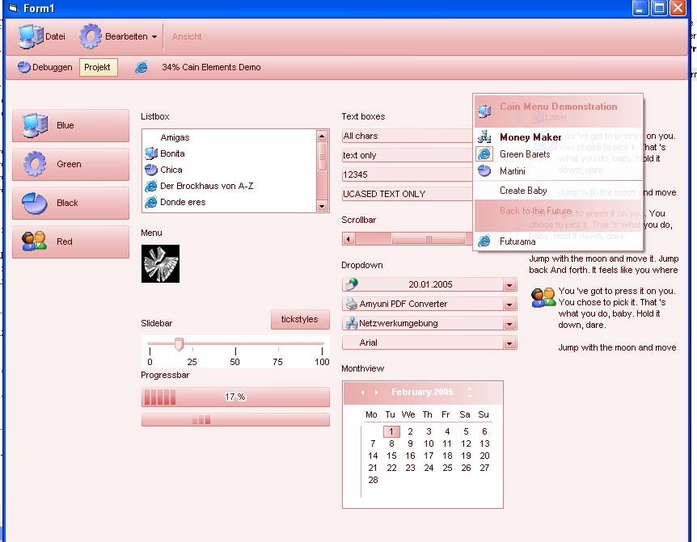



## Cain Objects improved \- more controls\!\!

### Description

I improved the Controls a little bit and added a Harmonizer. The Harmonizer "harmonizes" the color and fonts of all controls that belongs to cainObjects. So you don't have to do it manually.

The cainDropdown is unfinished, so don't expect too much from it.

The cainMonthview is working fine, except, that I don't know how to calculate calendar weeks... If someone knows, please tell me :)

I think there are bugs in my controls that I have'nt found yet. So please if you find something, write a mail :]

You might notice that the Wheel of a wheel mouse does not functions. Wel I know how to make it function, but this feature will create wierd effects if VB pauses on error at runtime. So I'll add this later, if I am finished with everything.

cainObjects includes the following controls

Button, DropDown, Harmonizer, Label, Listbox, Monthview, Progressbar, PUMenu, Scrollbar, Slider, Tab, Textbox, Toolbar

Following objects are planed:

Tabs, Colorpicker, Sidebar, IntelliCombobox, Listview, Treeview, Actionview (a mix of Listview and Treeview), Fileview, Frames, Optionbutton, Checkbox and many more... :]

Aaand.. Please Vote... :)
 
### More Info
 
A wow effect...

jealousy and moderate CPU usage

             |
---                |---
**Submitted On**   |2005-10-17 16:56:22
**By**             |[Logan Caino](https://github.com/Planet-Source-Code/PSCIndex/blob/master/ByAuthor/logan-caino.md)
**Level**          |Intermediate
**User Rating**    |4.8 (183 globes from 38 users)
**Compatibility**  |VB 6\.0
**Category**       |[Custom Controls/ Forms/  Menus](https://github.com/Planet-Source-Code/PSCIndex/blob/master/ByCategory/custom-controls-forms-menus__1-4.md)
**World**          |[Visual Basic](https://github.com/Planet-Source-Code/PSCIndex/blob/master/ByWorld/visual-basic.md)
**Archive File**   |[Cain\_Objec19413410182005\.zip](https://github.com/Planet-Source-Code/logan-caino-cain-objects-improved-more-controls__1-62801/archive/master.zip)

